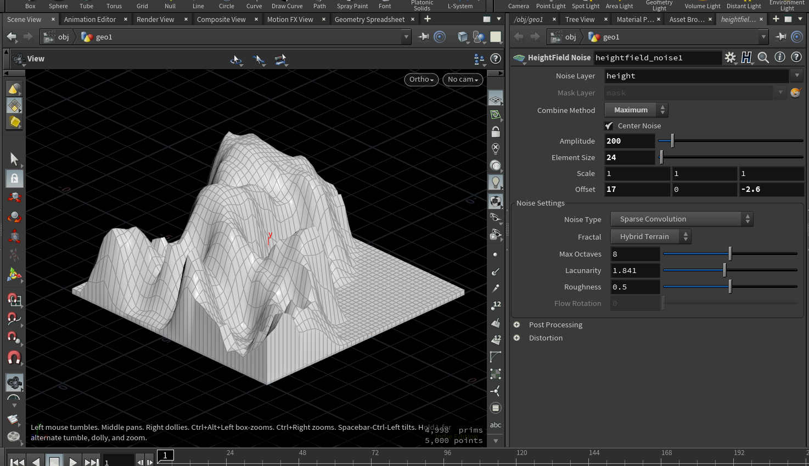
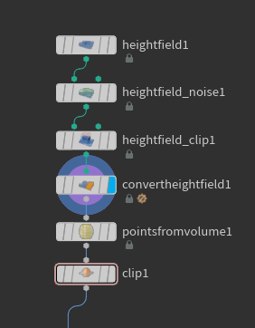
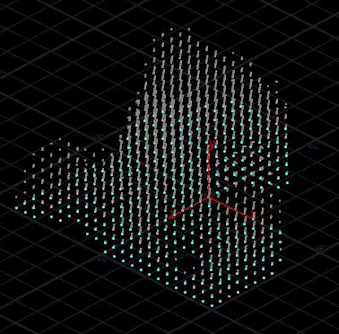
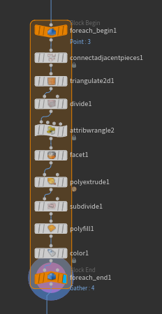

# Houdini Tutorial - Sliced Mountains

> Learn how to quickly generate Godus-like islands using Houdini's heightfields.

* * *

## Intro

Ludum Dare 44 is now over. It's been fun! Since quite a few people asked for it, here's a little breakdown of the islands in our game Seaway. You can see it in action [here](https://borderline.itch.io/seaway).

We wanted to recreate islands similar to the ones we find in *Godus*, in a more simplified version.

Here's how it works:
- Generate a heightfield
- Convert it to points
- Loop through all the points according to their height
- Reconstruct the slices from each layer of points

## 1 - Heightfield

The island height generation is quite basic. I only used one **HeightField Noise** SOP and played with the parameters till I was happy with the results. Just make sure to set *Combine Method* to *Maximum* so that we only get values above 0.

Here's what I came up with:



To get points from all of this we first need to convert the heightfield to polygons, using **HeightField Convert**. Then we can use a **Points from Volume**, and set the *Point Separation* to 2. This value will describe later on the height of each slice. Clip the points below 1 or more to remove every points from the ground and only keep separated bits of the heightfield.



Clipping the ground usually messes up our object position, we can reset it easily with some vex.
Append a **Point Wrangle** and add the following code:

```c#
@P -= getbbox_center(0);
@P.y += getbbox_size(0).y * .5;
```

At the same time we can also add a point attribute from the points height, so we can use it later in our loop to gather all the points by slice.

```c#
i@height = rint(@P.y);
```

## 2 - Reconstructing the slices

Now that each point has an attribute called **height** representing its layer, we can easily loop through them. Plug in a **For-Each Named Primitive** and set *Piece Elements* to *Points*, and *Piece Attribute* to our point attribute name **height**. You should be able to see each layer individually by ticking Single Pass.



We can now reconstruct the slices independently. Here's how it works:



First, a **Connect Adjacent Pieces** set to *Adjacent Points* go through all the points and creates connexions with all their neighbours within a certain radius. Here I set the search radius to something like 4, it depends of what shape you want to have.

Then a **Triangulate 2D** creates a mesh from the generated connexions. You can set the *2D Positions* to *Select Projection Plane* and leave the default settings. It makes sure every layer is remeshed in the same direction. This resets our layer's position though so we need to put it back to its original height. Simply get the current point *height* attribute and assign it to the current point Y position.

```c#
@P.y = i@height;
```

The **Divide** SOP is used to clean up the geometry. Untick *Convex Polygons* and tick *Remove Shared Edges* so that we're left with only one primitive from the triangulated mess. Follow that with a **Facet** to remove the inline points.

Then you can simply do a **PolyExtrude** and only output the sides, subdivide it, and put the caps back with a **PolyFill**.

Finally you can add a color node set to *Ramp from Attribute* or *Random from Attribute* and use the *height* to drive it.

That's it!


## 3 - Conclusion

You can download the source [**here**](../sources/sliced_mountain.hiplc)

[back](../)
